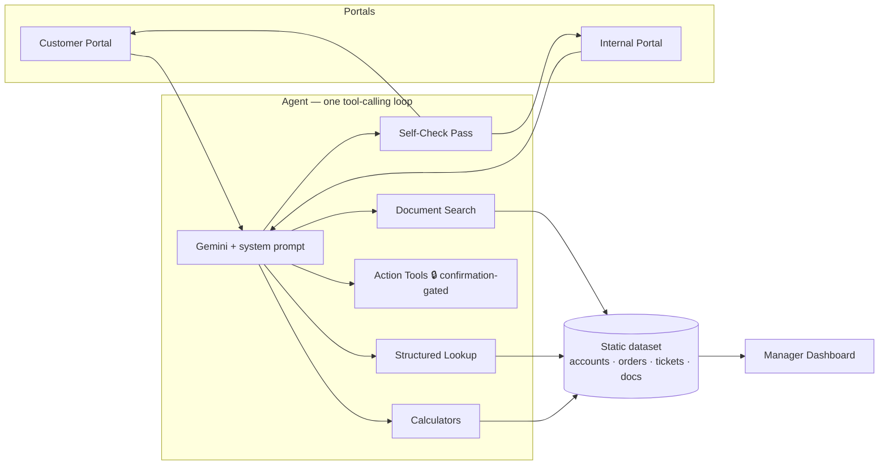

<div align="center">

# 📦 ParcelPilot Support Agent

**An AI support agent for a fictional B2B logistics platform** — built for the CalQuity AI
Engineer assessment, with access control enforced in code, actions gated behind human
confirmation, and answers checked for grounding before they're shown.

[](https://nextjs.org)
[](https://www.typescriptlang.org)
[](https://sdk.vercel.ai)
[](https://ai.google.dev)
[](https://tailwindcss.com)
[](#testing)

[Quick start](#quick-start) · [Architecture](#architecture-at-a-glance) · [Demo logins](#demo-logins) · [Docs](#documentation)

**Live:** https://parcelpilot-agent-eight.vercel.app

</div>

---

## What this is

Two chat surfaces — a **customer portal** and an **internal-ops portal** with a manager-only
issue-detection dashboard — share one agent backend, a single dynamic tool-calling loop over a
statically-parsed dataset (six source documents, four accounts, six orders, seven tickets). No
database, no fine-tuning: every number the agent states is computed in plain TypeScript, cited
back to its source, and double-checked before it reaches you.

| | |
|---|---|
| 🔐 **Access control in code** | Every tool call is scoped to the caller's account before any ranking or response generation happens — not left to model instructions. |
| 🧮 **Deterministic answers** | Dates, thresholds, and money are computed by calculators, never guessed by the model — against a fixed reference time, so results don't drift with the calendar. |
| ✋ **Confirmation before action** | Every state-changing tool (escalations, credit approvals, ticket updates) pauses for an explicit human click — cryptographically signed, so a crafted request can't fake it. |
| 🔍 **Self-checked answers** | A second model pass reviews high-stakes answers for citation accuracy and grounding before they're shown, and revises or escalates rather than guessing. |
| 📊 **Proactive issue detection** | A manager dashboard reuses the same calculators across every record — SLA breaches, known-issue clustering, a security auto-flag, and a historical-audit panel that catches stale past answers automatically. |

## Architecture at a glance



Full detail — request flow, confirmation-flow sequence diagram, and every design trade-off — is
in [`docs/HLD.md`](docs/HLD.md) and [`docs/LLD.md`](docs/LLD.md).

## Quick start

```bash
npm install

cp .env.example .env.local
# set GOOGLE_GENERATIVE_AI_API_KEY — a free key from https://aistudio.google.com/apikey

npm run parse-data   # optional — regenerates lib/data/*.json from the source workbook
npm run dev          # → http://localhost:3000
```

> Optionally set `PARCELPILOT_MODEL_ID` in `.env.local` to override the default Gemini model —
> useful if Google deprecates the current default (this happened once during development).

## Demo logins

No passwords — mocked authentication, [explicitly permitted by the assessment brief](docs/SUBMISSION_NOTES.md).

| Portal | Identity | Role |
|---|---|---|
| Customer | Northstar Logistics | Enterprise |
| Customer | LumenWorks | Growth |
| Customer | Beacon Retail | Standard |
| Customer | Axis Labs | Enterprise |
| Internal | Rohit | Support Agent |
| Internal | Priya Mehta | Manager — also sees the [Issue Detection Dashboard](docs/HLD.md#3-architecture-overview) |

## Testing

```bash
npm test          # full Vitest suite — data layer, tools, calculations,
                   # session/access-control, dashboard, key UI components
npm run build      # production build + type-check
```

## Project structure

```
app/             Next.js App Router — customer/internal portals, chat & login API routes
components/      ChatWindow, confirmation cards, confidence badges, dashboard widgets
lib/agent/       Tool definitions, action tools, self-check pass, system prompt
lib/tools/       Document search, structured lookup, deterministic calculators
lib/data/        Parsed dataset (accounts, orders, tickets, document chunks) + loaders
lib/dashboard/   Manager dashboard's flag computation (known issues, SLA, audits)
lib/identity/    Session encoding/decoding, role/surface guards
scripts/         One-off data-parsing script (workbook → lib/data/*.json)
```

## Documentation

| Doc | Covers |
|---|---|
| [`docs/HLD.md`](docs/HLD.md) | High-level architecture, request flow, confirmation-flow sequence diagram |
| [`docs/LLD.md`](docs/LLD.md) | Schemas, algorithms, state machines, error-handling table |
| [`docs/superpowers/specs/...design.md`](docs/superpowers/specs/2026-08-22-parcelpilot-agent-design.md) | Full design rationale — why each decision was made |
| [`docs/SUBMISSION_NOTES.md`](docs/SUBMISSION_NOTES.md) | The assessment's required Architecture Note, Product Note, and AI Tool Usage write-up |

## Deployment

Deploy on Vercel (Hobby/free tier): connect this repo in the Vercel dashboard, or run
`npx vercel --prod`, then set `GOOGLE_GENERATIVE_AI_API_KEY` as a Vercel environment variable.
Leave `EVAL_ENDPOINT` / `EVAL_API_KEY` unset in production — see
[`docs/HLD.md`](docs/HLD.md) §7/§10 for why.
