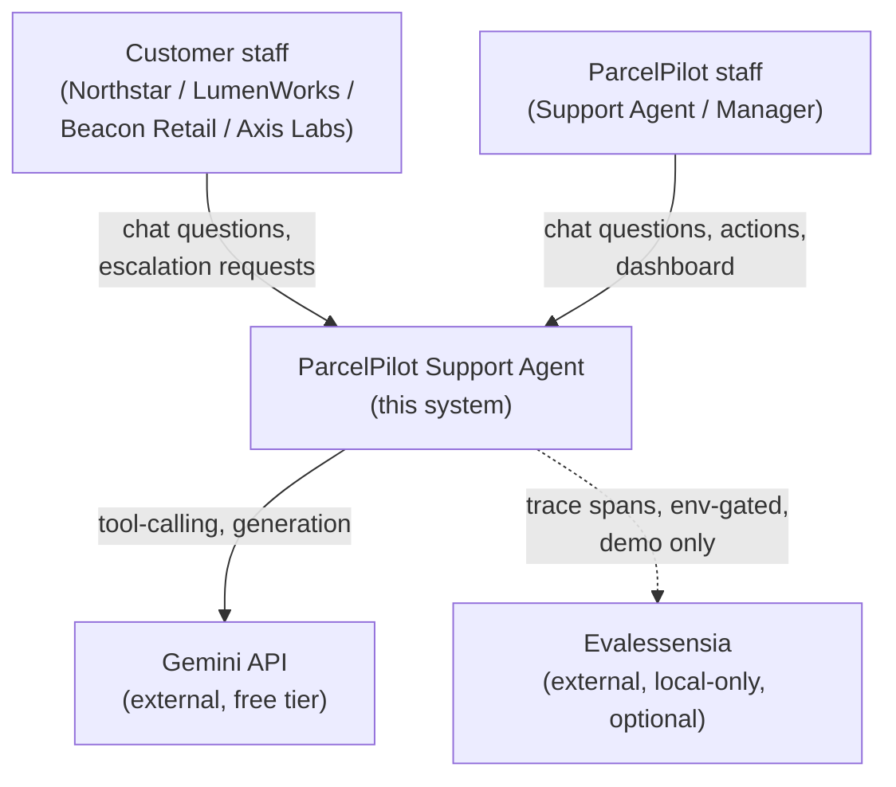
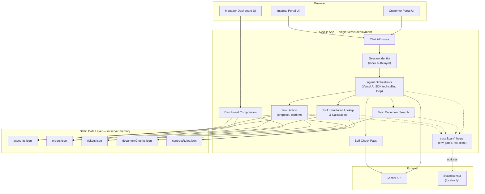
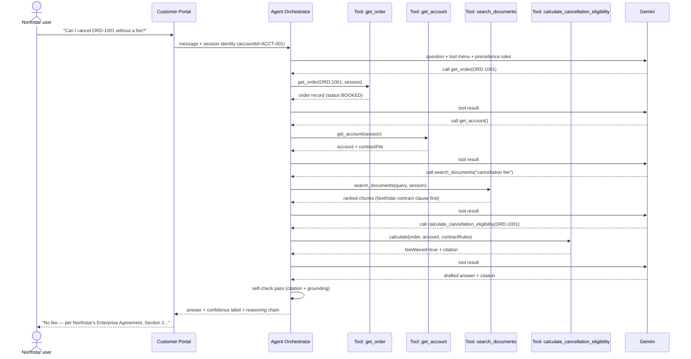
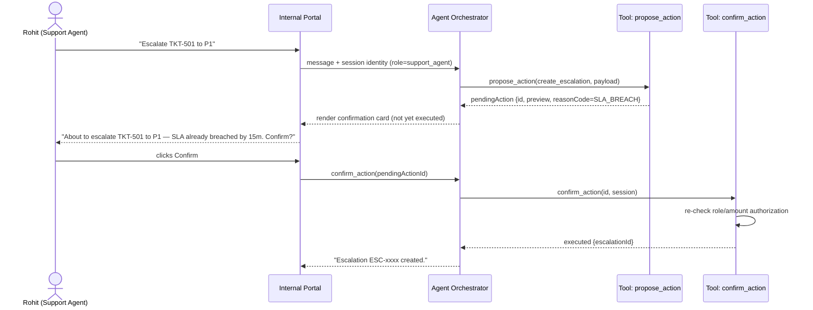
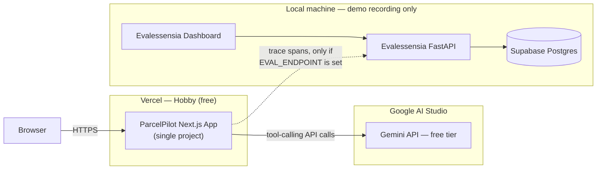

# High-Level Design — ParcelPilot Support Agent

**Companion documents:** [`LLD.md`](./LLD.md) for schemas/algorithms/module-level detail, [`superpowers/specs/2026-08-22-parcelpilot-agent-design.md`](./superpowers/specs/2026-08-22-parcelpilot-agent-design.md) for the full design rationale and trade-off discussion this HLD/LLD pair is derived from.

---

## 1. Purpose & Scope

A single AI agent backend serving two chat surfaces for ParcelPilot, a fictional B2B logistics platform:

- **Customer Portal** — business-customer staff (Northstar, LumenWorks, Beacon Retail, Axis Labs) ask account-scoped support questions and request escalation.
- **Internal Tools** — ParcelPilot support/ops staff investigate any account, answer questions, take actions, and (Manager role only) view a proactive issue-detection dashboard.

Both surfaces are thin frontends over one shared agent, tool layer, and dataset — differing only in the identity/role context attached to each session.

## 2. System Context

The system's only external dependency in the hosted deployment is the Gemini API. Evalessensia is wired in but inert (no-op) unless a local endpoint env var is set — it is not part of the hosted system's runtime dependency graph.

## 3. Architecture Overview

## 4. Major Components & Responsibilities

| Component | Responsibility |
|---|---|
| **Session Identity / Mock Auth** | Establishes who's asking (account or staff+role) from the select-from-list login; injects that identity into every downstream call. Never model-controlled. |
| **Agent Orchestrator** | Runs the single dynamic tool-calling loop: sees the question + tool menu + precedence rules, decides which tools to call and in what order, up to a step cap. |
| **Tool: Document Search** | Retrieves and ranks document chunks by relevance *and* authority metadata (current/deprecated, contract account-scope). |
| **Tool: Structured Lookup & Calculation** | Fetches records and performs all date/threshold/precedence math in code, returning pre-resolved answers with citation pointers. |
| **Tool: Action** | Two-phase propose/confirm for state-changing operations; re-validates authorization at confirm time. |
| **Self-Check Pass** | Second-pass review of high-stakes answers for citation accuracy and factual grounding before they reach the user. |
| **Dashboard Computation** | Reuses the calculation tool's logic across the full dataset (not per-question) to surface SLA risk, known-issue clusters, and historical-resolution conflicts. Manager-role only. |
| **traceSpan() helper** | Wraps tool/LLM calls; sends span data to Evalessensia only if an endpoint env var is set, otherwise a no-op. Also feeds the in-chat reasoning panel. |
| **Static Data Layer** | Parsed once at build time from the source PDFs/xlsx; shared, read-only, in server memory; no database service. |

## 5. Request Flow — Multi-Step Query

Example: *"Can Northstar cancel ORD-1001 without a fee?"*

## 6. Confirmation-Before-Action Flow

## 7. Deployment Architecture

One deployed service for the graded submission. Evalessensia is never part of the hosted deployment's runtime — see LLD §9 for the exact gating mechanism.

## 8. Non-Functional Design Goals

- **Cost:** zero paid infrastructure — free-tier LLM, no database service, no vector store, Vercel Hobby hosting. Cost discipline is achieved by pushing computation into deterministic code, never by reducing agent capability, step budget, or reasoning quality.
- **Reliability/Trust:** every direct answer carries a confidence label; conflicts between sources are surfaced, not silently resolved; a self-check pass guards high-stakes answers against miscitation and fabrication; anything outside the supplied data's coverage is escalated rather than guessed.
- **Security:** account/role scoping is enforced server-side inside every tool call, independent of model behavior — a prompt cannot widen what a session is allowed to fetch or execute.
- **Auditability:** every answer traces back to a specific document/section or a specific calculation; the reasoning chain is inspectable in the UI, not just asserted.

## 9. Out of Scope / Non-Goals

- Real authentication/authorization (mocked per the assignment's own allowance).
- A production-grade document ingestion pipeline (the 6-document corpus is hand-chunked once; not designed to scale to a large, changing corpus without revisiting the retrieval approach — see design spec §12).
- Real-time/trend-based anomaly detection on the dashboard (single static data snapshot; no time-series data exists to detect trends from).
- Deploying Evalessensia as a live, hosted component of this submission.
